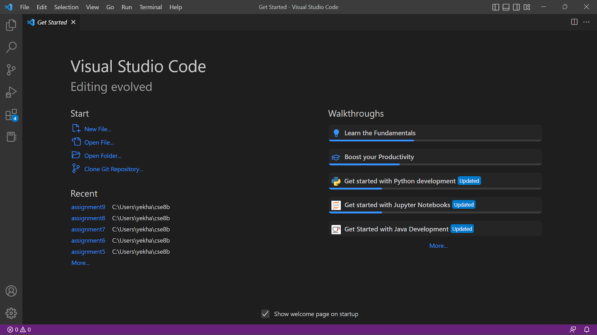
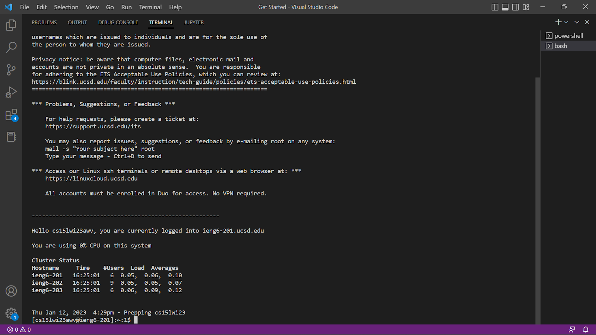

# How to log into a course-specific account on ieng6
After finding your course-specific account [here](https://sdacs.ucsd.edu/~icc/index.php), you will want to log into it on ieng6.

## Step 1: Open a terminal in VSCode
- [Install](https://code.visualstudio.com/download) and open VS Code. It should look something like this:

- Click the Terminal tab located at the very top
- Click New Terminal
- Ensure that the terminal is _git bash_. Hint: You will see the word _bash_ naming the specific terminal on the left column.

## Step 2: ssh
- Input the ssh command below in the terminal
`$ ssh cs15lwi23zz@ieng6.ucsd.edu`
- Here, zz should be replaced by the letters in your course-specific account

## Step 3: yes/no
- When connecting to a new server for the first time, it is expected to receive the message in the last step
- Type `yes` and hit enter

## Step 4: Enter your password
- As prompted, you will want to input the password to your course-specific account in the terminal
- Keep in mind, as you type there will be no changes to the screen. Simply hit enter once you've finished typing your password
- After correctly inputting your password, you will receive this message:

## Step 5: Try it out!
- Your terminal is now connected to a computer in the CSE basement, and any commands you run will run on that computer!
- Try some commands
- Here is how the `cat` command worked in my instance:

> 'cat' is short for concatenate! In this example, I am displaying the contents of the text file 'hello.txt' in the terminal. I am able to locate the file 'hello.txt' by its particular file path on the ieng6 server: '/home/linux/ieng6/cse15lwi23/public/hello.txt'.

## Congratulations! You've successfully logged into a course-specific account on ieng6.

