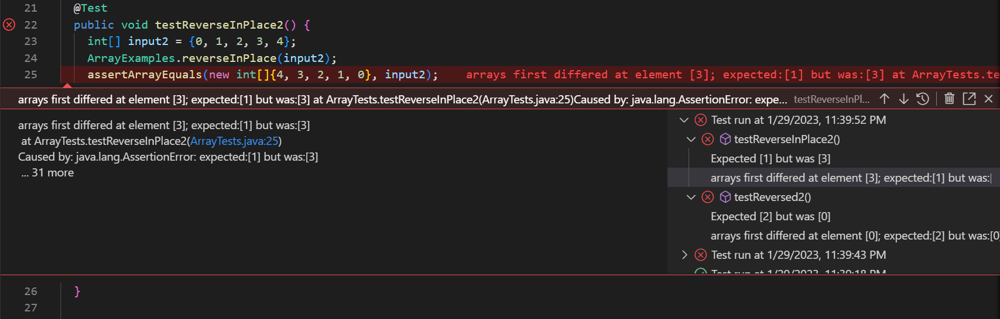
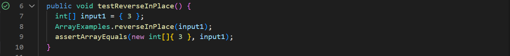

# Lab Report 2 - Servers and Bugs (Week 3)

## Part  1: StringServer

The code for my StringServer:
---
.png)

Using /add-message:
---
.png)
- Here, the handleRequest method is called.
- The relevant arguments to this method is the path of the url containing `/add-message`.
- The value of the `string` variable changes from an empty string `""` to `"Hello!"`. I was able to isolate this message by creating an array and separating the value after the `=` denoted in the url.

.png)
- Again, the handleRequest method is called. This time, the input for the url is different from the above example (since we have a different url).
- The relevant arguments to this method is the path of the url containing `/add-message`.
- The value of the `string` variable changes to also contain `"\n" + "My name is Hannah."`. I was able to add this value to `string` by saving the previous contents in the variable and adding new values to it.

## Part 2: Bugs from Lab 3
**Failure-inducing input for the buggy program (JUnit test):**
`@Test 
	public void testReverseInPlace2() {
    int[] input2 = {0, 1, 2, 3, 4};
    ArrayExamples.reverseInPlace(input2);
    assertArrayEquals(new int[]{4, 3, 2, 1, 0}, input2);
	}`

**Input that doesn't induce a failure (JUnit test):**
`@Test 
	public void testReverseInPlace() {
    int[] input1 = { 3 };
    ArrayExamples.reverseInPlace(input1);
    assertArrayEquals(new int[]{ 3 }, input1);
	}`

**The Symptom (output of running the tests):**
- Running failure-inducing input:

- Running non-failure-inducing input:

**The bug:**
- Before code change:
`static void reverseInPlace(int[] arr) {
    for(int i = 0; i < arr.length; i += 1) {
      arr[i] = arr[arr.length - i - 1];
    }
  }`
  
- After code change:
`static void reverseInPlace(int[] arr) {
    //creating a deep copy of arr
    int[] arrCopy = new int[arr.length];
    for(int i = 0; i < arr.length; i++) {
      arrCopy[i] = arr[i];
    }
    //reversing arr
    for(int i = 0; i < arr.length; i += 1) {
      arr[i] = arrCopy[arr.length - i - 1];
    }
  }`
> Originally, the code was solely working with 1 array. This resulted in the second half of the array not being able to change to the respective values in the original first half of the array (as the values had already been modified to contain the values in the second half). My code change was able to fix this issue by creating a deep copy of the array that can be referenced in the for loop when re-assigning values to the original array.

## Part 3: What I've Learned

In week 3, I learned what symptoms and bugs are defined as, the difference between these two terms, and how to identify them with real examples. In computer science, the symptom can be identified as the output when a test in a code fails. On the other hand, a bug is the problem itself in the code.
